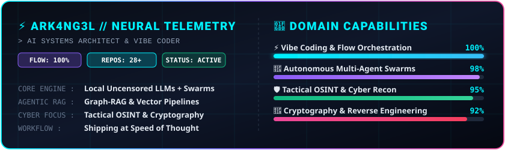

<div align="center">

  <!-- Holographic Cyber Banner -->
  <a href="https://github.com/ark4ng3l">
    
  </a>

  <br/><br/>

  <!-- Dynamic Glowing Typing Header -->
  <a href="https://github.com/ark4ng3l">
    
  </a>

  <br/>

  <!-- Cyber Status Badges -->
  <p align="center">
    
    
    
    
  </p>

  <p align="center">
    <a href="https://github.com/ark4ng3l?tab=followers"></a>
    <a href="https://github.com/ark4ng3l?tab=repositories"></a>
    
  </p>

</div>

---

<div align="center">

  <!-- Custom High-Tech SVG Neural Telemetry Matrix -->
  

</div>

---

```ascii
 ╔═════════════════════════════════════════════════════════════════════════════════╗
 ║  ARK4NG3L // NEURAL VIBE MATRIX                                                 ║
 ╠═════════════════════════════════════════════════════════════════════════════════╣
 ║  ⚡ SYSTEM STATE : PURE FLOW STATE • PROMPT-TO-DEPLOY PIPELINES                ║
 ║  🧠 AI ORCHESTRA : MULTI-AGENT SWARMS • GRAPH-RAG • LOCAL UNCENSORED LLMS       ║
 ║  🛡️ CYBER RECON  : OFFENSIVE/DEFENSIVE INTEL • CRYPTOGRAPHIC CRACKING • OSINT    ║
 ║  📍 ZERO-TRUST   : CYBERSPACE MATRIX // SHIP FAST, SECURE HARD                  ║
 ╚═════════════════════════════════════════════════════════════════════════════════╝
```

---

## 🔮 The Vibe Coder Mindset

> *"I don't manually hammer out boilerplate syntax. I orchestrate swarms of intelligences, iterate with surgical precision, and manifest complex cyber platforms and AI systems at the speed of thought."* ⚡

* 🧠 **Agentic Swarms & Graph-RAG:** Designing self-healing agent workflows, knowledge-graph retrieval pipelines, and local LLM inference engines.
* 🛡️ **Cybersecurity & Threat Forensics:** Building high-speed DNS intelligence tools, cryptographic analyzers, and OSINT visualization matrices.
* ⚡ **Ultra-Fast Prototyping:** Bridging raw abstract ideas into production-ready software in record-breaking flow sessions.

---

## 🌟 Featured Ecosystem & Repositories

<div align="center">

| Project | Specialization & Capabilities | Stack & Architecture |
| :--- | :--- | :--- |
| 🌐 **[AETHER](https://github.com/ark4ng3l/aether)** | **Tactical Cyber OSINT & Intelligence Platform**<br/>Powered by 6 local uncensored LLMs, real-time Cytoscape graph visualization, telemetry logging & automated recon. | `Python 3.13` `FastAPI` `Ollama` `Cytoscape` `OSINT` |
| 🤖 **[MasterAgent](https://github.com/ark4ng3l/MasterAgent)** | **Autonomous Multi-Agent Swarm Coordinator**<br/>Graph-RAG powered intelligence network with long-term persistent memory, Telegram Bot interface & CLI control center. | `Multi-Agent` `Graph-RAG` `Telegram API` `Python` |
| 🎙️ **[My AI Project](https://github.com/ark4ng3l/my_ai_project)** | **Multimodal Neural Voice Assistant**<br/>Dual-language speech recognition (Persian / English), offline TTS synthesizer, SQLite memory & Docker containerization. | `SpeechRecognition` `Transformers` `SQLite` `Docker` |
| 🔍 **[DNSLOOKUP](https://github.com/ark4ng3l/DNSLOOKUP)** | **Advanced DNS Intelligence Suite**<br/>Deep recon across 14 record types with millisecond latency benchmarking & multi-format table exports. | `Python` `dnspython` `Network Recon` `PrettyTable` |
| ⚡ **[HashTool](https://github.com/ark4ng3l/HashTool)** | **Multi-Core Cryptographic Cracker**<br/>High-performance parallel hash identifier & verifier supporting MD5, SHA-2/3, BLAKE2 algorithms. | `Multiprocessing` `Cryptography` `SecOps` |
| 🪙 **[Gold Manager ERP](https://github.com/ark4ng3l/gold2)** | **Persian Gold Jewelry Accounting & ERP**<br/>Comprehensive inventory management, invoicing, transaction logs & calculation engine with Jalali calendar. | `Python` `Tkinter` `SQLite` `Jalali Engine` |

</div>

---

## 🛠️ Cyber & Engineering Arsenal

<div align="center">

### 🤖 AI Orchestration & Agentic Flow
<p>
  
  
  
  
</p>

### 💻 Core Languages & Frameworks
<p>
  
  
  
  
  
</p>

### 🛡️ Cybersecurity & Forensics
<p>
  
  
  
  
</p>

### 📦 DevOps & Tooling
<p>
  
  
  
  
</p>

</div>

---

## 📊 Live GitHub Activity

<div align="center">
  <a href="https://github.com/ark4ng3l">
    
  </a>
</div>

---

<div align="center">
  
  ### 🌐 Connect & Collaborate
  
  <p align="center">
    <a href="https://github.com/ark4ng3l"></a>
    <a href="mailto:ark4ng3l@users.noreply.github.com"></a>
  </p>

  <sub>⚡ Crafted with pure flow & AI orchestration • <b>© 2026 @ark4ng3l</b></sub>

</div>
